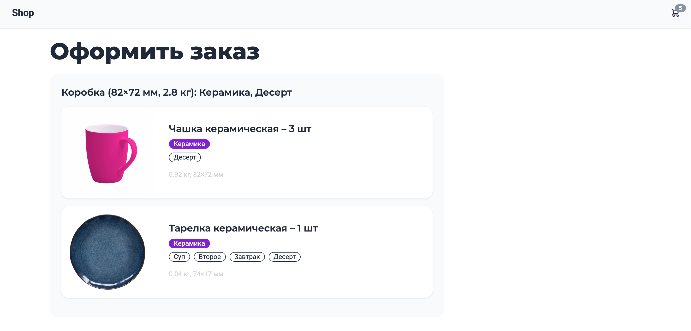

# Магазин посуды

Главная страница:


Страница корзины:


## Особенности
- Универсальный фильтр товаров реализован через scope
- Для создания нового фильтра нужно создать класс, который будет наследоваться от BaseFilter и зарегистрировать его в ProductServiceProdiver.php
- Оптимизированы запросы к БД: eager loading, индексы, агрегатные функции MySQL для расчета мин, макс значений в фильтре объеденены в один запрос
- Логика вынесена в сервис-классы
- Написаны функциональные тесты для фильтров, продуктов и корзины
- Тайпхинтинг для методов, свойств и аргументов
- Адаптивный дизайн
- Для передачи данных между Vue компонентами используется Vuex. Копия хранилища делается в LocalStorage.

Backend: Laravel ^8.75, PHP 8.0

Frontend:
Tailwind CSS 3,
Daisy UI,
Vue 3,
Vuex + LocalStorage

## Установка
```
composer create-project shop/shop
```

Запустить миграции и заполнить тестовыми данными:
```
php artisan migrate --seed
```
Тесты
```
php artisan test
```
## Задание
В магазине посуды есть несколько видов товаров:
- тарелки керамические
- тарелки алюминиевые
- ложки алюминиевые
- ложки стальные
- чашки керамические

В будущем магазин может завести и другие позиции в неограниченном количестве.

Каждый товар имеет свойство категория (тарелки, чашки, столовые приборы), материал, вес, размеры (длина и ширина), а также привязан к приемам пищи (одному или нескольким) для которого годится товар (суп, второе, завтрак или десерт).

Реализовать веб-страницу, где отображается список всех имеющихся товаров в магазине, которые можно отфильтровать по всем имеющимся свойствам.

У каждого товара сделать кнопку «Добавить в корзину».

Добавленные в корзину товары, должны группироваться по «картонным коробкам», в которые они будут упакованы. Товары упаковываются в одну коробку только если они из одного материала и могут быть использованы вместе хотя бы для одного общего приема пищи.

Для каждой коробки отобразить прием пищи, для которого годится набор, требуемый размер коробки (длина и ширина), вес коробки. Размер коробки считать по максимальному размеру предметов внутри (ш x в).

Админку для добавления товаров делать необязательно.

Требования по реализации: PHP ООП
